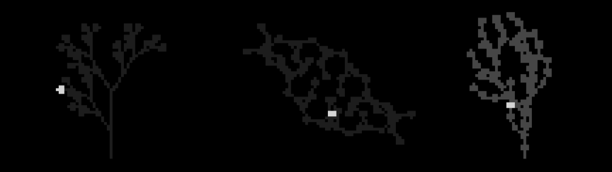

# Flora 
(beta) 
l-systems sequencer and bandpass filtered sawtooth engine for monome norns

- [Flora](#flora)
  * [Overview](#overview)
    + [L-systems and their sequencing](#l-systems-and-their-sequencing)
      - [L-system basics](#l-system-basics)
      - [Simple rewriting example (excluding the turtle and angle)](#simple-rewriting-example--excluding-the-turtle-and-angle-)
      - [Sequencing the L-system](#sequencing-the-l-system)
        * [The Flora alphabet](#the-flora-alphabet)
    + [Bandsaw](#bandsaw)
  * [Requirements](#requirements)
  * [Instructions for Norns](#instructions-for-norns)
    + [Pages](#pages)
      - [Plant](#plant)
      - [Modify](#modify)
      - [Observe](#observe)
      - [Plow](#plow)
      - [Water](#water)
    + [Generating new L-system axioms and rulesets](#generating-new-l-system-axioms-and-rulesets)
  * [Roadmap](#roadmap)
  * [Credits](#credits)
  * [References](#references)

## Overview
### L-systems and their sequencing
#### L-system basics
An L-system is a parallel rewriting mechanism originally conceived by Aristid Lindenmayer in 1968 as a mathematical model of plant development. 

The basic building blocks of an L-system include:

* Turtle graphics engine: First developed for the [Logo](https://en.wikipedia.org/wiki/Logo_(programming_language) programming language, a turtle creates a drawing from instructions that dictate when to move forward and when to rotate.
* Alphabet: A set of characters, each representing an instruction for an L-system algorythm to interpret (e.g. rotate, move forward, turn around, draw a line).
* Axiom: A letter or sentence representing the starting point of an L-system algorythm
* Rulesets: Each ruleset of an L-system contains two sentences. The first sentence always contains a single character. The second sentence contains one or more character. Each time it the algorythm runs, if the first sentence in the ruleset is encountered, it will replace the first sentence character with the character(s) of the second sentence. 
* Angle: An angle used by the turtle to rotate clockwise or counterclockwise, giving a new direction the next time it receives an instruction to draw a line.
* Generations: A generation represents a single execution of the L-system algorythm.
#### Simple rewriting example (excluding the turtle and angle)
Take the following: 
* Axiom: b
* Ruleset 1: b->a 
* Ruleset 2: a->ab 

The above axiom and rulesets will result in the following sentences when run 5 times, starting with the axiom 'b' as Generation 0. Ruleset 1 states that each time the character 'b' is encountered, it is replaced with 'a.' Ruleset 2 states that each time the character 'a' is encountered, it replaced with 'ab.'

* Generation 0: b 
* Generation 1: a 
* Generation 2: ab
* Generation 3: aba
* Generation 4: abaab
* Generation 5: abaababa

#### Sequencing the L-system
Flora leverages L-systems to algorithmically generate music, taking the angles written into L-system sentences as indicators of a change in pitch. 
##### The Flora alphabet
### Bandsaw
## Requirements

## Instructions for Norns
Basic instructions
### Pages
#### Plant
#### Modify
#### Observe
#### Plow
#### Water

### Generating new L-system axioms and rulesets

## Roadmap

## Credits
Flora's L-system code is a Lua-translation of the code presented in Daniel Shiffman's [The Nature of Code](https://natureofcode.com/book/chapter-8-fractals/)

*Bandsaw*, the bandpass-filtered sawtooth engine is based on Eli Fieldsteel's marimba presented in his [SuperCollider Tutorial #15: Composing a Piece, Part I](https://youtu.be/lGs7JOOVjag)
## References

