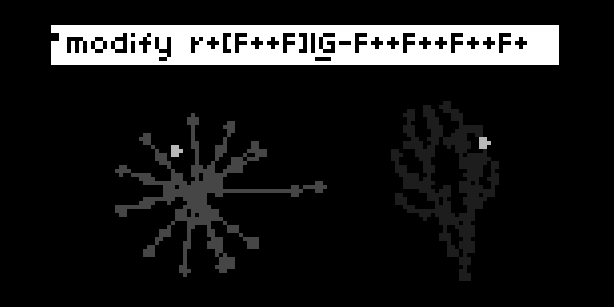
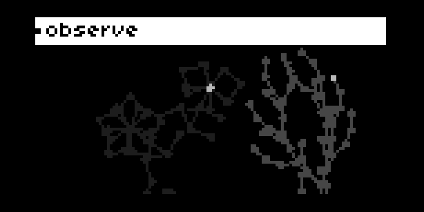
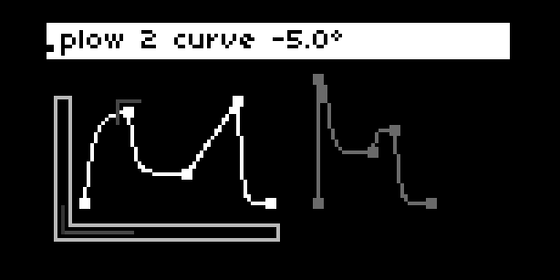

# Flora - beta

l-systems sequencer and bandpass filtered sawtooth engine for monome norns

- [Flora - beta](#flora---beta)
  * [Overview](#overview)
    + [L-systems and their sequencing](#l-systems-and-their-sequencing)
      - [L-system basics](#l-system-basics)
      - [Simple rewriting example](#simple-rewriting-example)
      - [Sequencing the L-system](#sequencing-the-l-system)
        * [The Flora alphabet](#the-flora-alphabet)
        * [Changes in pitch](#changes-in-pitch)
    + [Bandsaw](#bandsaw)
  * [Norns UI](#norns-ui)
    + [Pages](#pages)
      - [Plant](#plant)
      - [Modify](#modify)
      - [Observe](#observe)
      - [Plow](#plow)
      - [Water](#water)
    + [Generating new L-system axioms and rulesets](#generating-new-l-system-axioms-and-rulesets)
      - [Advanced sequencing](#advanced-sequencing)
  * [Requirements](#requirements)
  * [Roadmap](#roadmap)
  * [Credits](#credits)
  * [References](#references)


## Overview
### L-systems and their sequencing
#### L-system basics
An L-system is a parallel rewriting mechanism originally conceived by Aristid Lindenmayer in 1968 as a mathematical model of plant development. 

The basic building blocks of most L-systems include:

* Turtle graphics engine: First developed for the Logo programming language, a turtle creates a drawing from instructions that dictate when to move forward and draw and when to rotate to point in a different direction.
* Alphabet: A set of characters, each representing an instruction for an L-system algorithm to interpret (e.g. rotate, move forward, turn around, draw a line, etc.).
* Axiom: A sentence containing one or more characters that represents the starting point of an L-system algorithm.
* Rulesets: Each ruleset of an L-system contains two sentences. The first sentence typically contains a single character. The second sentence contains one or more character. Each time the algorithm runs, if the character contained in the first sentence of the ruleset is encountered, it will replace that character with the character(s) of the second sentence. 
* Angle: An angle used by the turtle to rotate clockwise or counterclockwise, giving it a new direction to move the next time it receives an instruction to draw a line.
* Generations: A generation represents a completed execution of the L-system algorithm.
#### Simple rewriting example 

Take the following: 
* Axiom: b
* Ruleset 1: b->a 
* Ruleset 2: a->ab 

The above axiom and rulesets will result in the following sentences when run 5 times, starting with the axiom 'b' as Generation 0. Ruleset 1 states that each time the character 'b' is encountered, it is replaced with 'a.' Ruleset 2 states that each time the character 'a' is encountered, it replaced with 'ab.'

* Generation 0: b 
* Generation 1: a 
* Generation 2: ab
* Generation 3: aba
* Generation 4: abaab
* Generation 5: abaababa


#### Sequencing the L-system

##### The Flora alphabet

| Character | Turtle Behavior | Sound Behavior  |
| ---------- | --------------- | --------------- |
| F   | Move the turtle forward and draw a line and a circle    | Play current note |
| G   | Move the turtle forward and draw a line | Resting note (silence)    |
| \[   | Save the current position    | Save the current note     |
| ]   | Restore the last saved position    | Restore the last saved note   |
| +   | Rotate the turtle counterclockwise by the current angle    | Increase the active note (see Changes in pitch below) |
| -   | Rotate the turtle clockwise by the current angle     | Increase the active note (see *Changes in pitch below*) |
| \|   | Rotate the turtle 180 degrees   | No sound behavior    |
| other | Other characters used in axioms and rulesets are ignored by the turtle | No sound behavior |

##### Changes in pitch
Flora leverages L-systems to algorithmically generate music, taking the angles written into L-system sentences as indicators of an increase or decrease in pitch. The amount of change in pitch is set by the angle measured in radians multiplied by the current pitch. Currently, the changes in pitch are quantized, so if an angle multiplied by the current pitch is not greater than a whole number, the pitch stays the same. 

If a change in angle results in a pitch that is greater than the number of notes in the active scale, the active note becomes the root note of the active scale. Conversely, if a change in angle results in a pitch that is less than the root note of the active scale, the active note becomes the last note in the active scale.

### Bandsaw
If the *output* parameter is set to include *audio*, notes will be played using *Bandsaw*, a bandpass filtered sawtooth wave, based on the marimba instrument demonstrated by Eli Fieldsteel in his [SuperCollider Tutorial #15: Composing a Piece, Part I](https://youtu.be/lGs7JOOVjag). 

The parameters of this instrument may be set in the PARAMETERS->EDIT menu or on the *water* page of the Flora program (see *water* below for more details)

## Norns UI

Flora's interface consists of 5 screens (or 'pages'). Navigation between pages occurs using encoder 1 (E1). The controls for each screen vary and can always be accessed using the key combination: Key 1 (K1) + Key 2 (K2). The instructions may also be found in the *flora_instructions.lua* file contained in the /lib directory.

For many parameter updated using the Encoder 2 (E2) and Encoder 3 (E3), fine-grained changes can be made by pressing K1 along with the encoder (specifics are detailed below.) 

### Screens
#### Plant 

```
e1: next page  
k1 + e1: switch active plant  
e3: inc/decr angle  
k2/k3: prev/next generation  
k1 + k3: reset plants  
```
Plant interface format: plant \[instruction number] \[current generation/max generations] a\[degree angle (degree radians)]

#### Modify 

```
e1: next/prev page  
k1 + e1: switch active plant  
e2: go to next/prev letter  
e3: change letter  
k2/k3: -/+ letter  
k1 + k3: reset plants  
```
Modify interface format: modify \[current sentence]

#### Observe 

```
e1: next/prev page  
k1 + e1: switch active plant  
e2: move up/down  
e3: move left/right  
k2/k3: zoom out/in  
k1 + k3: reset plants  
```

#### Plow 

```
e1: next/prev page 
k1 + e1: switch active plant  
e2: change control  
e3: change control value  
k2/k3: -/+ control point  
k1 + k3: reset plants  
```
Plow interface format:  plow \[control name]\[control value]

The Plow screen provides controls for two envelopes, one for each Plant sequence. An extension of Mark Eats' [envgraph class](https://github.com/monome/norns/blob/main/lua/lib/envgraph.lua), the envelopes controlled on this screen are applied to the Bandsaw engine when the envelopes'  respective Plant sequence triggers a note to play.

There are 5 controls for each of the two envelopes:
env level: the maximum amplitude of the envelope
env length: the length of the envelope
node time: when the node is processed by the envelope
node level: the level of the envelope at the node time
node angle: the ramp from the prior  node to the current node


#### Water 

```
e1: prev page  
e2: change control  
e3: change control value  
```
The water interface provides 
### Generating new L-system axioms and rulesets
#### Advanced sequencing

## Requirements

## Roadmap

## Credits
Flora's L-system code is a Lua-translation of the code presented in Daniel Shiffman's [The Nature of Code](https://natureofcode.com/book/chapter-8-fractals/)

*Bandsaw*, the bandpass-filtered sawtooth engine is based on Eli Fieldsteel's marimba presented in his [SuperCollider Tutorial #15: Composing a Piece, Part I](https://youtu.be/lGs7JOOVjag)
## References

