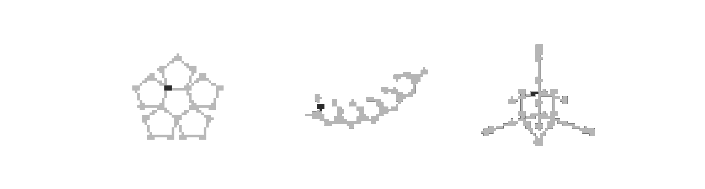
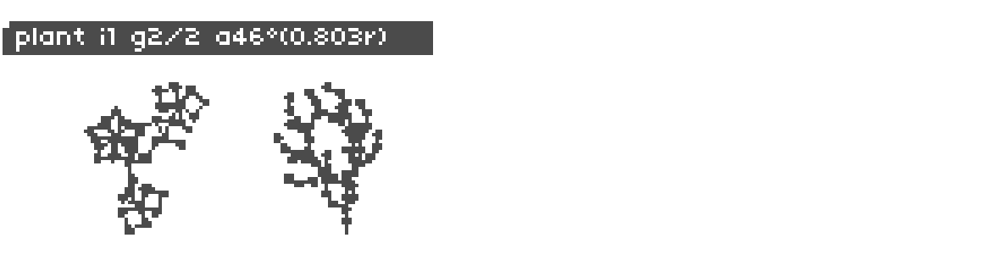
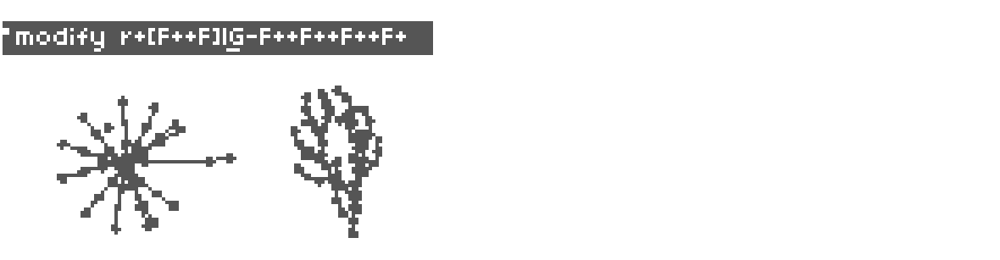
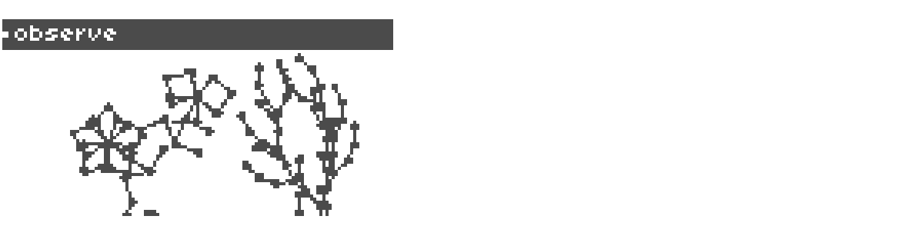
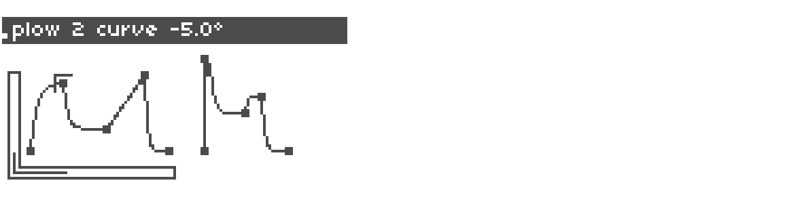
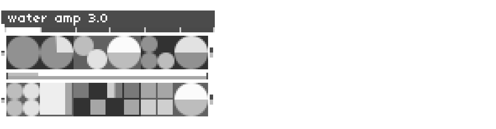

# Flora - beta

An L-systems sequencer and bandpass filtered sawtooth engine for monome norns

TODO: insert link to youtube and lines

- [Flora - beta](#flora---beta)
  * [Overview](#overview)
    + [L-systems and their sequencing](#l-systems-and-their-sequencing)
      - [L-system basics](#l-system-basics)
      - [Simple rewriting example](#simple-rewriting-example)
      - [Sequencing the L-system](#sequencing-the-l-system)
        * [The Flora alphabet](#the-flora-alphabet)
        * [Changes in pitch](#changes-in-pitch)
    + [Bandsaw](#bandsaw)  
        - [IMPORTANT SAFETY NOTES](#important-safety-notes)
  * [Norns UI](#norns-ui)
    + [Pages](#pages)
      - [Plant](#plant)
      - [Modify](#modify)
      - [Observe](#observe)
      - [Plow](#plow)
      - [Water](#water)
    + [Generating new L-system axioms and rulesets](#generating-new-l-system-axioms-and-rulesets)
      - [Advanced sequencing](#advanced-sequencing)
  * [Requirements](#requirements)
  * [Roadmap](#roadmap)
  * [Credits](#credits)
  * [References](#references)


## Overview
### L-systems and their sequencing
#### L-system basics
An L-system is a parallel rewriting mechanism originally conceived by Aristid Lindenmayer in 1968 as a mathematical model of plant development. 

The basic building blocks of most L-systems include:

* Turtle graphics engine: First developed for the Logo programming language, a turtle creates a drawing from instructions that dictate when to move forward and draw and when to rotate to point in a different direction.
* Alphabet: A set of characters, each representing an instruction for an L-system algorithm to interpret (e.g. rotate, move forward, turn around, draw a line, etc.).
* Axiom: A sentence containing one or more characters that represents the starting point of an L-system algorithm.
* Rulesets: Each ruleset of an L-system contains two sentences. The first sentence typically contains a single character. The second sentence contains one or more character. Each time the algorithm runs, if the character contained in the first sentence of the ruleset is encountered, it will replace that character with the character(s) of the second sentence. 
* Angle: An angle used by the turtle to rotate clockwise or counterclockwise, giving it a new direction to move the next time it receives an instruction to draw a line.
* Generations: A generation represents a completed execution of the L-system algorithm.
#### Simple rewriting example 

Take the following: 
* Axiom: b
* Ruleset 1: b->a 
* Ruleset 2: a->ab 

The above axiom and rulesets will result in the following sentences when run 5 times, starting with the axiom 'b' as Generation 0. Ruleset 1 states that each time the character 'b' is encountered, it is replaced with 'a.' Ruleset 2 states that each time the character 'a' is encountered, it replaced with 'ab.'

* Generation 0: b 
* Generation 1: a 
* Generation 2: ab
* Generation 3: aba
* Generation 4: abaab
* Generation 5: abaababa


#### Sequencing the L-system

##### The Flora alphabet

| Character | Turtle Behavior                                          | Sound Behavior                                                  |
| ---------- | ------------------------------------------------------- | --------------------------------------------------------------- |
| F          | Move the turtle forward and draw a line and a circle    | Play current note                                               |
| G          | Move the turtle forward and draw a line                 | Resting note (silence)                                          |
| \[         | Save the current position                               | Save the current note                                           |
| ]          | Restore the last saved position                         | Restore the last saved note                                     |
| +          | Rotate the turtle counterclockwise by the current angle | Increase the active note's pitch (see Changes in pitch below)   |
| -          | Rotate the turtle clockwise by the current angle        | Decrease the active note's pitch (see *Changes in pitch below*) |
| \|         | Rotate the turtle 180 degrees                           | No sound behavior                                               |
| other      | Other characters are ignored by the turtle              | No sound behavior                                               |

##### Changes in pitch
Flora leverages L-systems to algorithmically generate music, taking the angles written into L-system sentences as indicators of an increase or decrease in pitch. The amount of change in pitch is set by the angle measured in radians multiplied by the current pitch. Currently, the changes in pitch are quantized, so if an angle multiplied by the current pitch is not greater than a whole number, the pitch stays the same. 

If a change in angle results in a pitch that is greater than the number of notes in the active scale, the active note becomes the root (lowest) note of the active scale. Conversely, if a change in angle results in a pitch that is less than the root note of the active scale, the active note becomes the last (highest) note in the active scale.

### Bandsaw
If the *output* parameter is set in norns to include *audio*, notes will be played using *Bandsaw*, a bandpass filtered sawtooth wave, based on the marimba instrument demonstrated by Eli Fieldsteel in his [SuperCollider Tutorial #15: Composing a Piece, Part I](https://youtu.be/lGs7JOOVjag). 

Unlike a 'typical' oscillator, where the frequency of the oscillator is perceived as the note being played, the note's typically heard when the Bandsaw is played are determined by the center frequency of the bandpass filter, not the sawtooth oscillators frequency.

The parameters of this instrument may be set in the PARAMETERS->EDIT menu or on the *water* page of the Flora program (see *water* below for more details)

#### IMPORTANT SAFETY NOTES
**Note #1**   
The SuperCollider documentation for its [BandPassFilter (BPF)](https://doc.sccode.org/Classes/BPF.html) contains the following warning:  

> **WARNING: due to the nature of its implementation frequency values close to 0 may cause glitches and/or extremely loud audio artifacts!**  

For safety purposes, the minimum note frequency value is set to 0.2 to prevent loud noises. This safety measure is implemented in both the Bandsaw engine and the lua code for norns. 

**Note #2**  
The Bandsaw engine becomes loudly percussive as the values for rqmin and rqmax increase. Please take care not to hurt your ears, especially when using headphones.



## Norns UI

Flora's interface consists of five pages (or screens). Navigation between pages occurs using Encoder 1 (E1). While the controls for each screen vary, basic instructions for each screen can always be accessed using the key combination: Key 1 (K1) + Key 2 (K2). The instructions may also be found in the 'flora_instructions.lua' file contained in the /lib directory.

For many parameters, fine-grained adjustments can be made by pressing K1 along with the encoder (specifics are detailed below.) 

### Screens

The first three screens (or "pages") of the Flora program (Plant, Modify, and Observe) display two L-system plants, used by the program to sequence notes. The fourth screen (Plow) displays two envelopes and the fifth (Water) displays controls for the Bandsaw engine and other outputs (i.e. Midi, [Just Friends](https://www.whimsicalraps.com/products/just-friends?variant=5586981781533), and [Crow](https://monome.org/docs/crow/))

#### Plant 

```
e1: next page  
k1 + e1: switch active plant  
e3: inc/decr angle  
k2/k3: prev/next generation  
k1 + k3: reset plants to original forms and restart their sequences
```

#### Modify 

```
e1: next/prev page  
k1 + e1: switch active plant  
e2: go to next/prev letter  
e3: change letter  
k2/k3: -/+ letter  
k1 + k3: reset plants to original forms and restart their sequences
```

#### Observe 

```
e1: next/prev page  
k1 + e1: switch active plant  
e2: move up/down  
e3: move left/right  
k2/k3: zoom out/in  
k1 + k3: reset plants to original forms and restart their sequences
```

#### Plow 

```
e1: next/prev page 
k1 + e1: switch active plant  
e2: change control  
e3: change control value  
k2/k3: -/+ control point  
```

The Plow screen provides controls for two envelopes, one for each Plant sequence. An extension of Mark Eats' [envgraph class](https://github.com/monome/norns/blob/main/lua/lib/envgraph.lua), the envelopes controlled on this screen are applied to the Bandsaw engine when the envelopes'  respective Plant sequence triggers a note to play.

Unlike typical envelopes (AR, AD, ADSR, etc.), the Envelope class developed for this program  allows for a variable number of control points or 'nodes.' The program allows for anywhere from 3-20 nodes per envelope.

There are 5 types of controls for each of the two envelopes: 

env level: the maximum amplitude of the envelope  
env length: the length of the envelope  
node time: when the node is processed by the envelope  
node level: the level of the envelope at the node time  
node angle: the shape of the ramp from the prior node to the current node  

With a few exceptions, the last of the three types (node time, node level, and node angle) are adjustable for each of envelopes nodes.

Fine grain controls: All of the envelope controls allow for fine grain control using K1+E3

#### Water 

```
e1: prev page  
e2: change control  
e3: change control value  
```
The water interface provides control for the output parameters:  
* (all outputs) amp (fg): the overall amplitude of the outputs  
* (all outputs) p1 note dur: The length of each note for the first plant  
* (all outputs) p2 note dur: The length of each note for the second plant  
* (all outputs) note scalar (fg): This value is multiplied by the current angle of the plant, which is then added to the current note. This sets the next note to be played.
* (Bandsaw only) cf scalars: 1-4 CF (Center Frequency) Scalars are applied to the center frequency of the Bandsaw engine's bandpass filter to set the octave of the notes played by each plant. If more than one CF Scalar is activate, the active scalars are randomly selected each time a note is played.  
* (Bandsaw only) rq min/rq max (fg): These two parameters set the range of the reciprocal of the bandpass filter's [Quality](https://www.circuitstoday.com/band-pass-filters) values.  
* (Bandsaw only) note frequencies (fg): this sets the frequency of the Bandsaw's oscillations. Values less than ~20 will sound like individual tones. With larger values, the oscillations begin to blend into one another creating a single tone, a tone not related to the note set by the center frequency of the Bandsaw's bandpass filter.  The third note frequency parameter of each selected note frequency allows for fine grain control. The fourth note frequency parameter, tempo scalar offset, is shared between all frequencies (i.e. each frequency does not have its own unique tempo scalar offset). This provides a macro control over all note frequencies.

Fine grain controls: All of the water controls in the above list with the characters '(fg)' attached to the control names allow for fine grain control using K1+E3

### Generating new L-system axioms and rulesets
Instructions are curently held in `lib/gardens/garden_default.lua` There are seven required variables/tables for each l-system instruction set:

| Variable                | Description                                                                                 | 
| ----------------------- | ------------------------------------------------------------------------------------------- |  
| start_from              | the starting x, y screen coordinate (format: `vector:new(<x>,<y>)`                          |
| ruleset                 | table to hold the ruleset(s)                                                                |
| ruleset[<index>]        | the l-system ruleset(s) (format: `rule:new('<character>',"<character(s)")`                  |
| axiom                   | the starting sentence (format: `"<character(s)>"`                                           |
| max_generations         | the maximum number of generations                                                           |
| length                  | the starting length (in pixels) of the segments drawn by the turtle                         |
| angle                   | the default turtle rotation angle (in degrees)                                              |
| initial_turtle_rotation | initial turtle rotation angle (in degrees) before executed prior to evaluating the ruleset  |
| starting_generation     | the initial generation to display                                                           |

Example instruction set :
```
instruction.start_from = vector:new(screen_size.x/2-10, screen_size.y - 10)
instruction.ruleset = {}
instruction.ruleset[1] = rule:new('F',"F++F++F|F-F++F")
instruction.axiom = "F++F++F++F++F++F"
instruction.max_generations = 2
instruction.length = screen_size.y/8
instruction.angle = 36
instruction.initial_turtle_rotation = 0
instruction.starting_generation = 1
```

#### Advanced sequencing
*Multiple rulesets*

*Evolving rulesets*

## Requirements

## Roadmap

## Credits
Flora's L-system code is a Lua-translation of the code presented in Daniel Shiffman's [The Nature of Code](https://natureofcode.com/book/chapter-8-fractals/)

*Bandsaw*, the bandpass-filtered sawtooth engine is based on Eli Fieldsteel's marimba presented in his [SuperCollider Tutorial #15: Composing a Piece, Part I](https://youtu.be/lGs7JOOVjag)


## References


